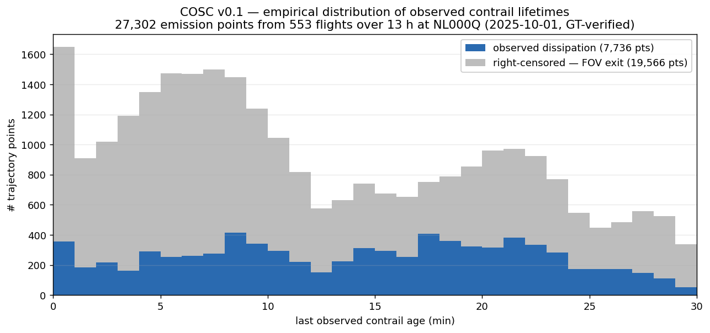
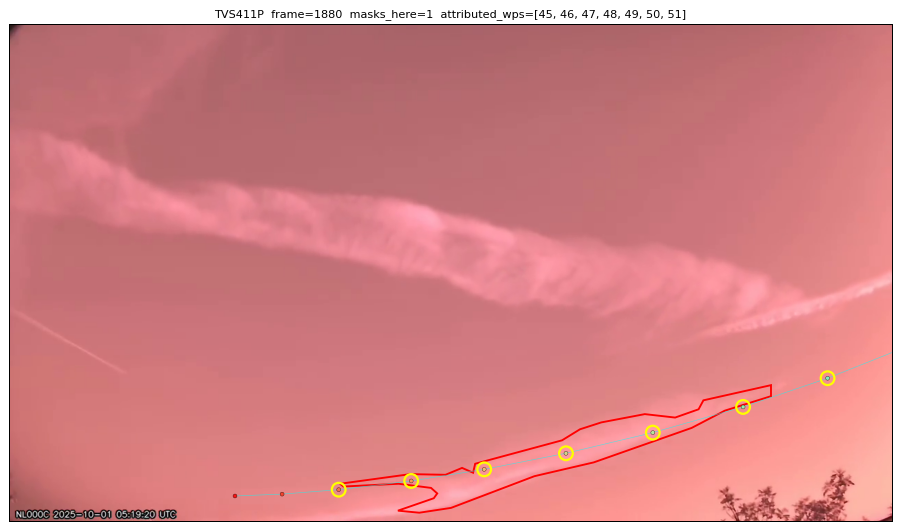
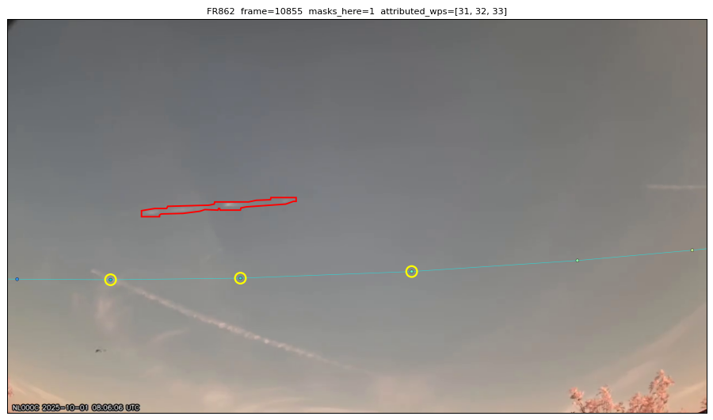

# cosc-tools

Producer + spec for the **COSC** dataset — *Contrail Observations from Sky Cameras*.

A research dataset of contrail observations from ground-based sky cameras,
paired with per-trajectory-point empirical lifetimes. Built to let
researchers benchmark contrail-evolution models (CoCiP, RFM, custom)
against detected-from-the-ground reality.



*The headline of the v0.1-preview release: across 553 flights and
27,302 emission points over a single 13 h sky-camera video, this is
how long each contrail remained detectable. Right-censored points
(grey) are ones where the contrail drifted out of FOV before
dissipating — its true lifetime is at least the value shown.
Censoring is per-row metadata in the dataset, so any survival-
analysis-aware comparison handles it correctly. Pipeline output is
capped at 30 min contrail age; the rightmost bin reflects the cap,
not the natural maximum.*

<table>
<tr>
<td width="50%"></td>
<td width="50%"></td>
</tr>
<tr>
<td><em>Inside one frame: the contrail mask (red), the flight's projected trajectory (cyan + rainbow dots = waypoints), and the trajectory points whose emission produced this mask (yellow rings). Every detection event in the dataset has these per-frame attributions backing it.</em></td>
<td><em>The wind-error regime: same picture, but the modelled trajectory (cyan, below) is offset ~150 px from where the actual contrail (red, above) drifted. The dataset attributes correctly via along-track projection regardless of perpendicular offset.</em></td>
</tr>
</table>

## Licenses

- **Code** (this repository): [PolyForm Noncommercial 1.0.0](https://polyformproject.org/licenses/noncommercial/1.0.0). Free for research, academic, personal, and other non-commercial use. Commercial use requires a separate written agreement.
- **Dataset** (the published parquet release): [CC-BY-NC-4.0](https://creativecommons.org/licenses/by-nc/4.0/). Same scheme, with attribution.
- **Commercial use of either**: contact the maintainer.

See [`LICENSE`](LICENSE) for the code license verbatim and
[`specs/DATASET_CARD.md`](specs/DATASET_CARD.md) for the dataset terms.

## Project layout

```
cosc-tools/
├── specs/                      Public dataset documentation
│   ├── SCHEMA.md               Normative column-level schema for v0.1
│   └── DATASET_CARD.md         License, scope, cleaning spec, citation
├── cosc/                       Producer package
│   ├── schema.py               Arrow schema definitions for every table
│   ├── attribute.py            Projection-only trajectory-point attribution
│   ├── build.py                Per-video producer
│   └── cli.py                  `python -m cosc.cli build <staging_dir>`
├── examples/                   Reader examples
│   └── load_v01.ipynb          Minimal load + per-emission-lifetime plot
└── README.md                   (this file)
```

## Quickstart

### Install

```bash
git clone https://github.com/Cybis320/cosc-tools.git
cd cosc-tools
pip install -e .
```

### Read the dataset

Download the [v0.1-preview release](https://github.com/Cybis320/cosc-tools/releases/tag/v0.1-preview)
(NL000Q, GT-verified, ~8 MB):

```bash
wget https://github.com/Cybis320/cosc-tools/releases/download/v0.1-preview/cosc-v0.1-preview-NL000Q.tar.gz
tar xzf cosc-v0.1-preview-NL000Q.tar.gz
```

```python
import pandas as pd
base = "cosc-v0.1/country=NL/station=NL000Q/date=2025-10-01"

# Atomic per-frame attributions (the time-resolved evidence)
events = pd.read_parquet(f"{base}/detection_events.parquet")

# Aggregated per-trajectory-point observations (headline table for model comparison)
obs = pd.read_parquet(f"{base}/trajectory_point_observations.parquet")
```

See [`examples/load_v01.ipynb`](examples/load_v01.ipynb) for a runnable
quickstart (loads the preview, summarises GT/censoring stats, plots
per-emission-point observed contrail lifetime for one flight). Run with:

```bash
pip install -e '.[examples]'
jupyter notebook examples/load_v01.ipynb
```

See [`specs/SCHEMA.md`](specs/SCHEMA.md) for the full column-by-column contract.

### Build the dataset from a Janus pipeline output

```bash
python -m cosc.cli build /path/to/staging_dir --out_root /path/to/cosc-v0.1
```

## Status

**v0.1 — DRAFT**. Single station (NL000C). Schema is locked. Cleaning spec
section in `DATASET_CARD.md` is still being collated and will be finalized
before the v0.1.0 tagged release.

## How to compare a model to COSC

For each row in `trajectory_point_observations`:

1. Run your contrail-evolution model on the emission point
   `(flight_id, emit_ts_utc, emit_lat, emit_lon, emit_alt_geom_m)`.
2. Compare your model's predicted dissipation age to `detect_last_age_s`.
3. **Handle censoring**: rows with `censored_fov_exit = True` or
   `censored_video_end = True` are right-censored (lifetime ≥ reported,
   actual may be longer). Standard survival-analysis methods (Kaplan–Meier,
   Cox PH) handle this.

For higher-resolution comparison, use `detection_events` (one row per
`(flight, mask, frame)` attribution) to compare time-resolved predictions
to the empirical detection density curve.

## Contact

For commercial use of either the code or the dataset, dataset issues, or
schema discussions: **Luc Busquin** &lt;[luc.busquin@contrailcast.com](mailto:luc.busquin@contrailcast.com)&gt;.
